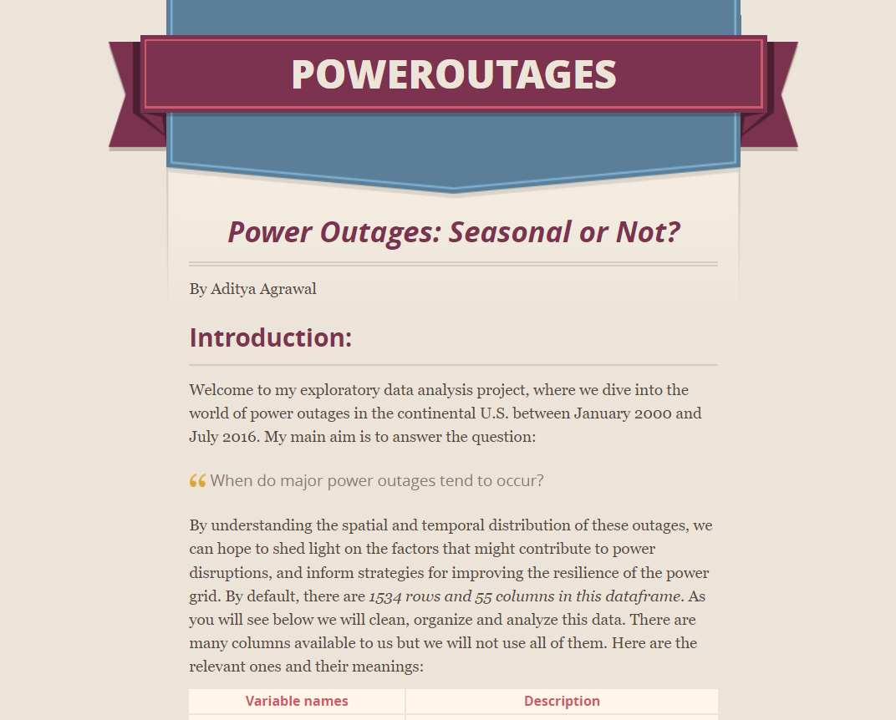

# Aditya Agrawal
 - UCSD Data Science and Cognitive Science with Machine Learning and Neural Computation
 - Open for full time positions and internships
 - Graduating 2024 (next year)

**Click on the links below to view the repository of the project**

# [S&P 500 STOCK RECOMMENDATION PROJECT](https://github.com/AdiA32/SP500-ML-Project)
### *(ML,LSTM,NLP,DEEP LEARNING, FINANCIAL MODELLING, VISUALIZATION)*

***check out this [POSTER](#stocks-poster) for a visual and deeper overview!***

<!-- **(WIP)** This is an ongoing project as part of the UCSD *Data Science Student Society(DS3) Projects Committee 2023*. This project began with a dataset of historical S&P 500 data and an original goal of building a stock recommendation system - i.e using AI and ML models to predict the Opening Price movement of a given stock. Given this background, we approached this challenge in 2 ways:

* **Financial Modelling** - Predicted Opening Stock Price of Google Stocks (GOOGL)  using- Random Forests, LSTMs, Koopman Neural Networks, all implemented in Python with TensorFlow and scikit-learn packages.
* **Scraping Twitter** -  We used the Twitter API to perform Sentiment Analysis on tweets that referenced a given stock and tried to build a system to analyse whether the Twitter sentiment has an effect on the opening Price of the stock.  -->

## Project Introduction
This project aims to optimize stock portfolio allocation utilizing a blend of LSTM models, sentiment analysis, and portfolio optimization techniques. LSTM models forecast stock movements, while sentiment analysis gleans insights from Twitter and news data. Recommendations from these techniques are optimized through an Efficient Frontier model to maximize return for a given risk level.

## LSTM Models
We selected LSTM for its capability to capture long-term dependencies and handle non-stationarity in stock prices. However, it does not account for the Random Walk Hypothesis. The LSTM model demonstrated reasonable accuracy in predicting Google's opening price movements, albeit with an average overprediction of $3.04 per day.

## Sentiment Analysis
I first systematically extract data big news and financial websites like Motley Fool, Yahoo Finance, Bloomberg, The Wall Street Journal, Reuters, Fortune, Business Wire, TheStreet.com, and sort for news on anything that might affect any given stock. It then processes and runs sentiment scores on 100+ articles per stock and finally returns the sentiment scores and over a week's period of time. This methodology inspects the other side of trading: emotions, and gives us a sense of recent market happenings that provide for a deeper analysis.

VADER: Used VADER, rule-based sentiment analysis tool. Strengths include simplicity, ease of interpretation, and low computational resource requirements. However, it struggles with complex sentences and sarcasm. Luckily, news channels seem to have straightforward sentiment. Pros: Dynamic and complete overview of stock sentiment. Many news sources. Cons: Reliance on textual analysis may miss nuanced implications of financial metrics. Accuracy may be influenced by potential biases in sourced articles.

## Portfolio Optimization
The Efficient Markets Problem is circumvented using Modern Portfolio Theory, focusing on Return and Risk rather than predicting price. The Efficient Frontier is graphed, providing a visual representation of the optimal portfolio combinations for the highest expected return for a given risk level or vice versa.

## Future Direction
Future steps encompass enhancing sentiment analysis, exploring other deep learning models like CNNs or transformer models for stock predictions, investigating advanced portfolio optimization methods, developing a real-time portfolio recommendation tool, improving model interpretability, and establishing performance metrics via backtesting.

# [Predicting Power Outages](https://adia32.github.io/poweroutages/)
### *(Data Analysis, Machine Learning, Hypothesis Testing, NMAR analysis, Visualization, Supervised Learning)*
<!--  -->

  <iframe src="https://adia32.github.io/poweroutages/" style="position:absolute; top:0px; left:0px; 
  width:100%; height:100%; border: none; overflow: hidden;"></iframe>

*[Website](https://adia32.github.io/poweroutages/)*

Just check out the website linked above! This project is presented amazingly when I first started working with Github Pages! The website is still a work in progress and I am working on the prediction part. Timeline: will be done in 1 week (6/10/2023). 

# [FAKE AMAZON REVIEWS PROJECT](https://github.com/sukikrishna/FARS)
### *(ML, DECISION TREES, RANDOM FOREST CLASSIFIERS,LINEAR ALGEBRA, NLP, N-Grams Classification)*
The project revolves around the development of a model to predict the validity of mock Amazon product reviews. By utilizing n-grams, random forest machine learning models, sentiment analysis, and other tools, the goal is to create an accurate and reliable solution. Data from Amazon's extensive database of product reviews serves as the foundation for this project.

N-grams are employed to extract features from the text data, capturing contextual relationships between words. These sequences of n words enable the identification of patterns and linguistic nuances, which play a crucial role in determining the validity and sentiment of the reviews.

Random forest classifiers are utilized to classify the reviews effectively. This ensemble learning method combines multiple decision trees, resulting in robust predictions. By utilizing the extracted n-grams as input features, the random forest model learns from labeled data, where the validity of reviews is known, and can subsequently predict the validity of new, unseen reviews.

Additionally, sentiment analysis techniques are applied to analyze the sentiment expressed in the reviews. This enables the model to determine the emotions and polarity associated with the text, further enhancing the prediction accuracy.

Throughout the project, various tools and techniques such as preprocessing, feature engineering, and model optimization are employed. Steps like tokenization, stop word removal, and stemming are applied to clean and standardize the text data. Feature engineering techniques such as TF-IDF assign weights to the n-grams based on their relevance. Cross-validation and hyperparameter tuning ensure optimal performance of the random forest models.

The resulting model aims to provide a robust and efficient solution for predicting the validity of mock Amazon product reviews. Such a tool has the potential to automate the review classification process, enhance quality control, and improve the overall credibility of product reviews on Amazon's platform.

# [BookGPT Language Model](https://github.com/AdiA32/BookGPT-Language-Model)
### *(Data Scraping, Creating Corpus, Tokenization, Model Building, N-Grams Classification)*
Driven by my fascination with the revolutionary Chat GPT and an eagerness to delve into the underpinnings of such a technology, I embarked on an exploratory journey to design my own language model. This project allowed me to apply and expand upon my pre-existing Python programming skills and dive into the enthralling world of Natural Language Processing (NLP).

This project employed various computational linguistics techniques, such as tokenization, data scraping, and corpus creation, utilizing the Project Gutenberg library as a primary source of data. Data scraping was employed to gather textual data from the internet, particularly from Project Gutenberg, a vast library of over 60,000 free eBooks. Python libraries like Beautiful Soup and requests were used to aid this process, extracting content from the website and storing it for subsequent processing. After which I created custom tokenization functions and built a corpus. 

The essence of the project involved constructing an N-gram language model, a powerful, probabilistic technique used to predict the next item in a sequence. Despite its apparent simplicity, the N-gram model forms the backbone of many language model systems, including earlier versions of Chat GPT.

The engineering process started with data collection and pre-processing, where I demonstrated my dexterity in data manipulation using Numpy and Pandas, essential Python libraries renowned for their efficiency. To build the model, I wrote a recursive function to compute the conditional probabilities of words given their preceding context, thereby grasping the intricacies of recursive design.

A noteworthy feature of my project was successfully compute the frequencies and probabilities of different N-grams and create a language model capable of generating coherent sentences. In the testing phase, I focused on evaluating the model's performance and adjusting the parameters for improved text generation. The project culminated with a language model that managed to generate relatively coherent sentences, shedding light on how state-of-the-art models like Chat GPT could operate.

Throughout the process, I not only enhanced my programming skills but also gained a profound understanding of NLP, probabilistic models, and the core concepts of language model development. My foray into this project was a testament to my curiosity, technical aptitude, and drive to understand and replicate cutting-edge AI technology.

# [Project Mentality](https://github.com/AdiA32/Mentality)
### *(Python, Automation, Mobile-Integration, Web scrapping)*
The "Project Mentality" is an automated program designed to deliver daily curated quotes from famous thinkers to the user's phone via SMS. Its main purpose is to provide motivation and inspiration for personal improvement on a daily basis.

The program employs web scraping techniques to gather quotes from various online sources such as websites, blogs, and social media platforms. The scraped data undergoes analysis and data cleaning processes to ensure the accuracy and relevance of the quotes, eliminating any errors or inconsistencies.

Using Python, the program is automated to deploy daily and send the curated quotes directly to the user's phone as SMS messages. This automation is achieved by integrating APIs or third-party services that enable sending SMS messages from a Python script. By integrating with SMS gateway providers, the program ensures seamless delivery of the curated quotes, providing a convenient and accessible user experience.

Furthermore, the project involves learning advanced techniques for automated web deployment. This includes setting up a reliable hosting environment using containerization technologies like Docker and leveraging cloud platforms such as AWS or Google Cloud for efficient scaling and management.

In summary, the "Project Mentality" is an automated program that delivers daily curated quotes to the user's phone via SMS. Through web scraping, data cleaning, and mobile integration, it aims to motivate users and inspire personal growth. The project also emphasizes learning advanced techniques for automated web deployment to ensure smooth operation and scalability.

# [Python BlackJack Simulation](https://github.com/AdiA32/Project-Blackjack)
In this project, I implement a Python simulation of a Blackjack game using object-oriented programming techniques. Blackjack is a card game typically played at casinos where each player competes against the dealer to get a score closest to 21, without going over 21. At the start of the game, each player and the dealer are given 2 cards. A person's set of cards is referred to as their hand. The player's own cards (their hand) are visible to themselves and only one of the dealer's cards is visible to everyone. After everyone receives their cards, the dealer asks each player whether they would like to hit (take another card) or stand (keep their current cards). Each player can hit (take a card) as many times as they would like to get their score as close to 21 as possible, without going over. Afterwards, the dealer reveals their card and decides to hit or stand. Lastly, the final scores are calculated and the winner is announced

# Stocks Poster

Presented at UCSD Supercomputer Center by Aditya Agrawal - Project Team Head  